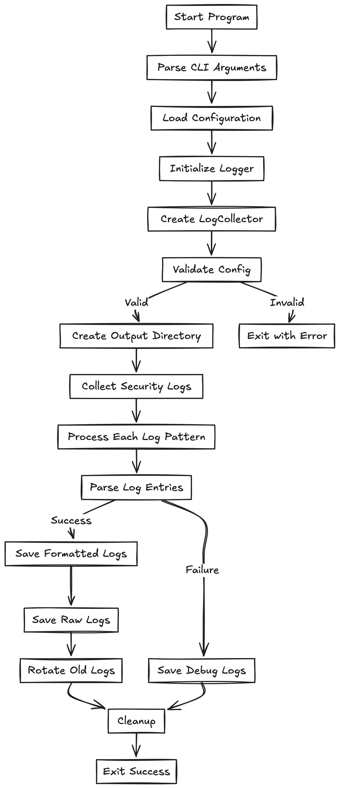

# macOS Security Logger Documentation

## Overview

macOS Security Logger is a professional-grade tool designed to collect, process, and manage security logs from macOS systems. This documentation will guide you through using and understanding the tool.



## Quick Start

### Basic Setup

1. **System Requirements**
   - macOS 10.15 or later
   - Rust toolchain
   - Administrator privileges

2. **Installation Commands**
   ```bash
   # Install tool
   cargo install macos-security-logger

   # Verify installation
   macos-security-logger --version
   ```

### First Run
```bash
# Create basic configuration
mkdir -p config
cat > config/default.json << EOL
{
    "output_dir": "./logs",
    "retention_days": 30,
    "max_file_size": 104857600,
    "save_raw_json": true,
    "json_pretty_print": true,
    "log_patterns": [
        "process == \"securityd\" OR process == \"sandboxd\"",
        "category == \"security\"",
        "subsystem == \"com.apple.security\""
    ]
}
EOL

# Run with verbose output
sudo macos-security-logger --verbose
```

## Understanding Log Collection

### Log Collection Process


1. **Initialization Phase**
   - Configuration validation
   - Directory setup
   - Log pattern compilation

2. **Collection Phase**
   - System log querying
   - Pattern matching
   - Raw data collection

3. **Processing Phase**
   - JSON parsing
   - Data structuring
   - Error handling

### Log Data Structure


Each log entry contains:
- Timestamp
- Process information
- Event details
- Additional metadata

## Configuration Guide

### Configuration Structure
```json
{
    "output_dir": "./logs",
    "retention_days": 30,
    "max_file_size": 104857600,
    "save_raw_json": true,
    "json_pretty_print": true,
    "log_patterns": [
        "process == \"securityd\" OR process == \"sandboxd\"",
        "category == \"security\"",
        "subsystem == \"com.apple.security\""
    ]
}
```

### Pattern Writing Guide

1. **Process Filtering**
   ```
   process == "securityd"
   process == "sandboxd"
   process == "socketfilterfw"
   ```

2. **Category Filtering**
   ```
   category == "security"
   subsystem == "com.apple.security"
   ```

3. **Message Content**
   ```
   eventMessage CONTAINS[c] "violation"
   eventMessage CONTAINS[c] "denied"
   ```

4. **Combined Patterns**
   ```
   process == "securityd" AND category == "security"
   subsystem == "com.apple.security" OR category == "security"
   ```

## Log File Management

### Log Lifecycle


1. **File Types**
   - Formatted logs (`security_logs_[timestamp].json`)
   - Raw logs (`security_logs_raw_[timestamp].json`)
   - Debug logs (`debug_log_[timestamp].json`)

2. **Rotation Policy**
   - Based on file size
   - Based on age
   - Based on retention policy

3. **Directory Structure**
   ```
   logs/
   ├── security_logs_20241213_120000.json
   ├── security_logs_raw_20241213_120000.json
   ├── debug_log_20241213_120000.json
   └── ...
   ```

## Advanced Usage

### Component Architecture


### Class Structure


### Advanced Commands
```bash
# Custom output file
sudo macos-security-logger --output custom_output.json

# Custom config file
sudo macos-security-logger --config my_config.json

# Debug mode
sudo macos-security-logger --verbose

# Combine options
sudo macos-security-logger --verbose --config custom.json --output logs.json
```

## Troubleshooting

### Common Issues

1. **Permission Errors**
   ```
   Error: Failed to execute log command: Permission denied
   ```
   Solution: Run with sudo privileges

2. **No Logs Found**
   ```
   Info: No logs found matching criteria
   ```
   Solution: Check log patterns in configuration

3. **Parse Errors**
   ```
   Error: Failed to parse log entries
   ```
   Solution: Check debug logs for raw output

### Debugging Steps

1. Enable verbose logging
2. Check debug log files
3. Verify log patterns
4. Ensure directory permissions
5. Check system log availability

## Best Practices

1. **Log Pattern Design**
   - Start with broad patterns
   - Refine based on needs
   - Use combined patterns wisely

2. **Resource Management**
   - Set appropriate retention periods
   - Monitor disk usage
   - Regular log rotation

3. **Security Considerations**
   - Secure log storage
   - Regular backups
   - Access control

## Performance Optimization

1. **Pattern Optimization**
   - Use specific patterns
   - Limit time ranges
   - Combine related patterns

2. **Storage Optimization**
   - Regular cleanup
   - Compression
   - Archive old logs

## Use Cases

1. **Security Monitoring**
   - Track security violations
   - Monitor access attempts
   - Audit system changes

2. **System Auditing**
   - Track process behavior
   - Monitor system changes
   - Analyze patterns

3. **Compliance**
   - Log retention
   - Audit trails
   - Security documentation